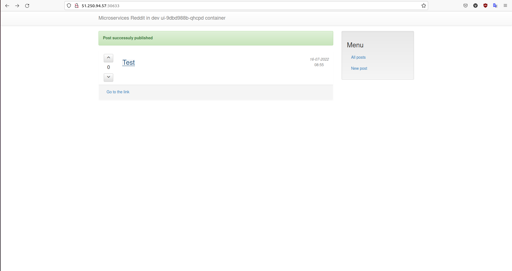
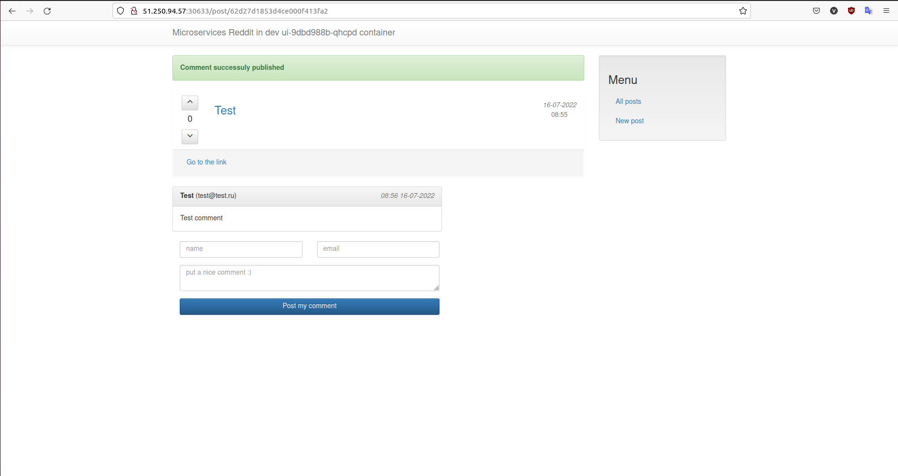

# Vlashm_microservices
Vlashm microservices repository

## Домашнее задание 21

- Развернут кластер *Kubernetes* в Yandex Cloud с помощью манифестов *terraform* из предыдущего дз.
- Познакомился с сетевым взаимодействиев в *Kubernetes*
- Установлен *Ingress* в Yandex Cloud
- Написан и применен манифест *Ingress* для сервиса *UI*
- Создан самоподписной сертификат TLS и загружен в *Kubernetes*
- Добавлен и применен манифест *NetworkPolicy*
- Создан диск в Yandex Cloud командой:

                yc compute disk create \
                --name k8s \
                --size 4 \
                --description "disk for k8s"

- Созданы *PersitentVolume* и *PersistentVolumeClaim*

### Задание со *

Добавлен манифест для секрета сертификата

## Домашнее задание 20

- Установлен *kubectl*
- Установлен и запущен *Minikube*
- Выполнены все шаги из дз для запуска приложения в локальном окружении
- Для запуска *dashboard* в *minikube* используется команда `minikube dashboard`
- Развернут кластер *Kubernetes* в Yandex Cloud
- Для получения контекста кластера используется команда `yc managed-kubernetes cluster get-credentials <cluster-name> --external`
- Запущены манифесты:

                kubectl apply -f ./kubernetes/reddit/dev-namespace.yml
                kubectl apply -f ./kubernetes/reddit/ -n dev

- Получены адреса нод и порт сервиса приложения:

                kubectl get nodes -o wide
                kubectl describe service ui -n dev | grep NodePort

- Cкриншот веб-интерфейса приложения в кластере:

### Задание со *

- В директории *kubernetes/terraform-k8s-yc* созданы манифесты для разворачивания кластера *Kubernetes* в Yandex Cloud
- В директории *kubernetes/dashboard* созданы манифесты для подключения *dashboard*. Влючается командами:

                kubectl apply -f https://raw.githubusercontent.com/kubernetes/dashboard/v2.5.0/aio/deploy/recommended.yaml
                kubectl apply -f ./kubernetes/dashboard/admin-user.yml
                kubectl apply -f ./kubernetes/dashboard/cluster-role.yml
                kubectl -n kubernetes-dashboard create token admin-user
                kubectl proxy

## Домашнее задание 19

- Созданы файлы с *Deployment* манифестами приложений
- Установлены *Docker* и *k8s* на ВМ
    - Установка *Docker*:

                sudo apt-get update
                sudo apt-get install apt-transport-https ca-certificates curl software-properties-common
                curl -fsSL https://download.docker.com/linux/ubuntu/gpg | sudo apt-key add -
                sudo add-apt-repository "deb [arch=amd64] https://download.docker.com/linux/ubuntu  $(lsb_release -cs)  stable"
                sudo apt-get update
                sudo apt-get install -y docker-ce=5:19.03.15~3-0~ubuntu-bionic docker-ce-cli=5:19.03.15~3-0~ubuntu-bionic

    - Установка *k8s*:

                curl -s https://packages.cloud.google.com/apt/doc/apt-key.gpg | sudo apt-key add
                echo "deb https://apt.kubernetes.io/ kubernetes-xenial main" | sudo tee -a /etc/apt/sources.list.d/kubernetes.list
                sudo apt-get update
                sudo apt install -y kubelet=1.19.16-00 kubeadm=1.19.16-00 kubectl=1.19.16-00
                sudo apt-mark hold kubelet kubeadm kubectl

    - Инициализация master-ноды:

                kubeadm init --apiserver-cert-extra-sans=<external_ip_master> \
                --apiserver-advertise-address=0.0.0.0 \
                --control-plane-endpoint=<external_ip_master> \
                --pod-network-cidr=10.244.0.0/16

    - Добавление work-ноды:

                kubeadm join <external_ip_master>:6443 --token <token> \
                    --discovery-token-ca-cert-hash sha256:<cert-hash>

    - Для управления кластером через *kubectl*:

                mkdir -p $HOME/.kube
                sudo cp -i /etc/kubernetes/admin.conf $HOME/.kube/config
                sudo chown $(id -u):$(id -g) $HOME/.kube/config

- Установлен плагин *Calico*:
    - Загружен манифест на master-ноду
    - В манифесте определена переменная *CALICO_IPV4POOL_CIDR*
    - Применен манифест командо `kubectl apply -f calico.yaml`

- Применены все магифесты reddit

### Задание со *

- В директорию *kubernetes/terraform* добавлины манифесты для поднятия виртуальных машин
- В директорию *kubernetes/ansible* добавлены плэйбуки для установки *Docker* и поднятия кластера

## Домашнее задание 18

- Обновлен код приложений
- Собраны образы и отправлены в *Dockerhub*
- Создан файл *docker/docker-compose-logging.yml*
- Создан файл *logging/fluentd/Dockerfile* для сборки образа *Fluentd* с нужной нам конфигурацией
- Создан файл *logging/fluentd/fluent.conf* с конфигурацией *Fluentd*
- Доработан файл *docker/docker-compose.yml*
- В конфигурацию *Fluentd* добавлены фильтры для:
    - Структурированных логов приложения *POST*
    - Неструктурированных логов приложения *UI*
- Доработан файл *docker/docker-compose-logging.yml* сбора трейсов

### Задание со *

- Добавлен фильтр для ещё одного формата логов:

        <filter service.ui>
            @type parser
            format grok
            grok_pattern service=%{WORD:service} \| event=%{WORD:event} \| path=%{URIPATH:path} \| request_id=%{UUID:request_id} \| remote_addr=%{IP:remote_addr} \| method=%{GREEDYDATA:method} \| response_status=%{INT:response_status}
            key_name message
            reserve_data true
        </filter>

- Загружено багованное приложение в директорию *src-bugged*:
    - Анализ трейсов *Zipkin* показал, что задержка происходит при обращении к приложению *POST* из-за изменившихся IP и Порта.
    - Внесены изменения в *docker/docker-compose.yml* для устранения ошибки.
    - Дальнейший анализ показал, что по той же причине возникает ошибка при обращении к приложнению *COMMENT*. Так же внесены изменения для устранения этой ошибки

## Домашнее задание 17

- Познакомился с работой *Prometheus*
- Создан *Dockerfile* и файл конфигурации *Prometheus*
- Файл *docker-compose.yml* доработан для работы с *Prometheus*
- Образы загружены в https://hub.docker.com/u/vlashm

### Задание со *

- В *Prometheus* добавлен мониторинг *MongoDB*
- В *Prometheus* добавлен мониторинг сервисов comment, post, ui с помощью *Blackbox*
- Добавлен *Makefile* для сборки и отправки образов, запуска и остановки приложения

## Домашнее задание 16

- Создана конфигурвция *terraform* для поднятия ВМ
- Написан плэйбук *ansible* для установки *Docker* на ВМ
- Запущен контейнер *gitlab-ce*. Пароль root для доступа получается выполнением на ВМ команды `sudo docker exec -it gitlab grep 'Password:' /etc/gitlab/initial_root_password`
- Выполнены все шаги основного ДЗ

### Задание со *

- Добавлен плэйбук для поднятия *Gitlab* на ВМ, также добавлен плэйбук для получения пароля root
- Добавлен плэйбук для запуска и регистрации *Gitlab-Runner*
- В пайплайн добавлены *build_docker_image* для сборки Docker образа с приложением и *start_docker_image* для запуска контейнера
- Настроено оповещение в Slack. https://app.slack.com/client/T6HR0TUP3/C037B9DPHS7

## Домашнее задание 15

- Выполнены задания по работе с сетями *Docker*
- Установлен *Docker-compose* и выполнена сборка образов приложения с его помощью.
- Внесены изменения в *docker-compose.yml* под кейс с множеством сетей, сетевых алиасов
- Параметризированны:
    - Логин пользователя в *Docker Hub*
    - Порт приложения
    - Версии приложений
    - Драйвер сетей
- Базовое имя проекта берется из директории, в которой находится файл *docker-compose.yml*. Изменить имя проекта можно, запустив *docker-compose* с флагом *-p* (или *--project-name*) или задав переменную окружения *COMPOSE_PROJECT_NAME*

### Задвние со *

Создан файл *docker-compose.override.yml* внесены изменения:
- Чтобы изменять код каждого из приложений, не выполняя сборку образа дректорию с кодом необходимо подключить к *volume*
- Чтобы запускать puma для руби приложений в дебаг режиме с двумя воркерами добавлена команда *command*.

## Домашнее задание 14

- Приложение разбито на несколько контейнеров
- Создан и подключен *Docker volume*

### Задание со *

Запуск контейнеров с другими сетевыми алиасами:

    docker run -d --network=reddit \
    --network-alias=post_db_new \
    --network-alias=comment_db_new \
    mongo:latest

    docker run -d --network=reddit \
    --network-alias=post_new \
    --env POST_DATABASE_HOST='post_db_new' \
    vlashm/post:1.0

    docker run -d --network=reddit \
    --network-alias=comment_new \
    --env COMMENT_DATABASE_HOST='comment_db_new' \
    vlashm/commentdocker network create reddit
docker volume create reddit_db='post_new' \
    --env COMMENT_SERVICE_HOST='comment_new' \
    -p 9292:9292 \
    vlashm/ui:1.0

### Задание со *

Оптимизированы образы в файлах *Dockerfile.1*

    REPOSITORY       TAG            IMAGE ID       CREATED          SIZE
    vlashm/post      2.0            f8b71a4b3d93   13 seconds ago   115MB
    vlashm/comment   2.0            18dd6cd8ee31   29 minutes ago   145MB
    vlashm/ui        3.0            376c75a47a2c   37 minutes ago   147MB
    vlashm/ui        2.0            6abaf03a746c   20 hours ago     463MB
    vlashm/post      1.0            568e266d7ade   20 hours ago     121MB
    vlashm/ui        1.0            e34424adecb6   20 hours ago     772MB
    vlashm/comment   1.0            18cd3816e17f   21 hours ago     770MB

## Домашнее задание 12 и 13

- Установлен Docker
- С помощью Docker machine создан Docker хост в YC
- Создан образ с приложением и базой данных.
- Из созданного образа запущен контейнер.
- Образ загружен на Docke Hub

### Задание со *

В директории *docker-monolith/infra* созданы прототипы:
- Ansible:
    - Плэйбук *install_docker.yml* для установки Docker
    - Плэйбук *install_app.yml* для запуска созданного образа
    - Подключен динамический инвентарь *yc_compute*
- Packer:
    - Создает *image* с установленным Docker
- Terraform:
    - Поднимает инстансы в заданном количестве
